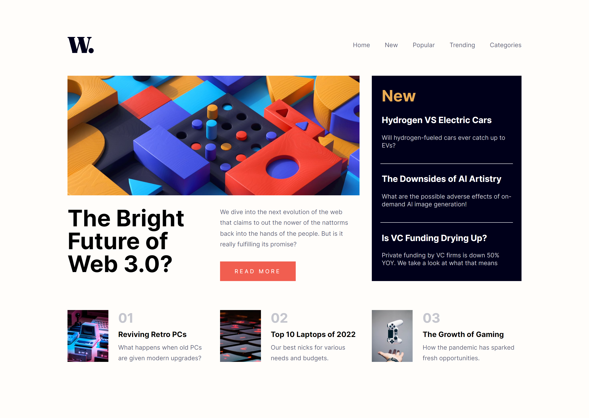
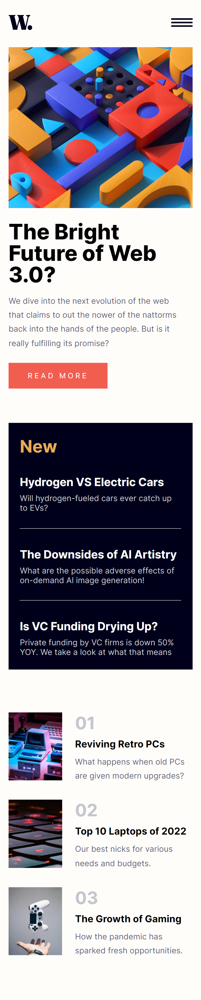

# Frontend Mentor - News homepage solution

This is a solution to the [News homepage challenge on Frontend Mentor](https://www.frontendmentor.io/challenges/news-homepage-H6SWTa1MFl). Frontend Mentor challenges help you improve your coding skills by building realistic projects. 

## Table of contents

- [Overview](#overview)
  - [The challenge](#the-challenge)
  - [Screenshot](#screenshot)
  - [Links](#links)
- [My process](#my-process)
  - [Built with](#built-with)
  - [What I learned](#what-i-learned)
  - [Useful resources](#useful-resources)
- [Author](#author)


## Overview

### The challenge

Users should be able to:

- View the optimal layout for the interface depending on their device's screen size
- See hover and focus states for all interactive elements on the page
- **Bonus**: Toggle the mobile menu (requires some JavaScript)

### Screenshot




### Links

- Solution URL: [Solution](https://github.com/andyjv1/News-Homepage-Main.git)
- Live Site URL: [Live](https://andyjv1.github.io/News-Homepage-Main/)

## My process

### Built with

- Semantic HTML5 markup
- CSS custom properties
- Flexbox
- CSS Grid
- Mobile-first workflow
-JS

### What I learned

In this project, i learned how to use CSS grid. This is a great project to implement this type od display.  also learn how to make a toggle the mobile menu and how to use transform/translation.

```css
.mainBody {
    display: grid;
    grid-template-areas:
        'nav nav nav nav nav nav'
        'bigImgDesk bigImgDesk bigImgDesk bigImgDesk new new'
        'textbigMainBodyh1 textbigMainBodyh1 smalltext smalltext new new'
        'beige1 beige1 beige2 beige2 beige3 beige3';
    grid-gap: 1.75rem 1.88rem;
}
#myLinks {
    display: none;
    position: absolute;
    height: 100%;
    width: 16rem;
    right: -16rem;
    background-color: hsl(36, 100%, 99%);
    transition: 0.3s;
    transition-delay: 250ms;
    z-index: 1;
}
```
```js
function mobileMenu1() {
        document.getElementById("myLinks").style.right = '-16rem'
        document.getElementById("overlay").style.display = 'none'
}
```

### Useful resources

- [A Complete Guide to CSS Grid](https://css-tricks.com/snippets/css/complete-guide-grid/) - This helped understand CSS Grid which allowed me to make this project look as close to the answer as possible.
- [CSS Transitions and Transforms for Beginners](https://thoughtbot.com/blog/transitions-and-transforms) - This article  helped me understand Transitions and Transforms for the toggle menu
- [How TO - Mobile Navigation Menu](https://www.w3schools.com/howto/howto_js_mobile_navbar.asp) - This article helped me understand how to make a toggle menu.
## Author

- Frontend Mentor - [@andyjv1](https://www.frontendmentor.io/profile/andyjv1)
